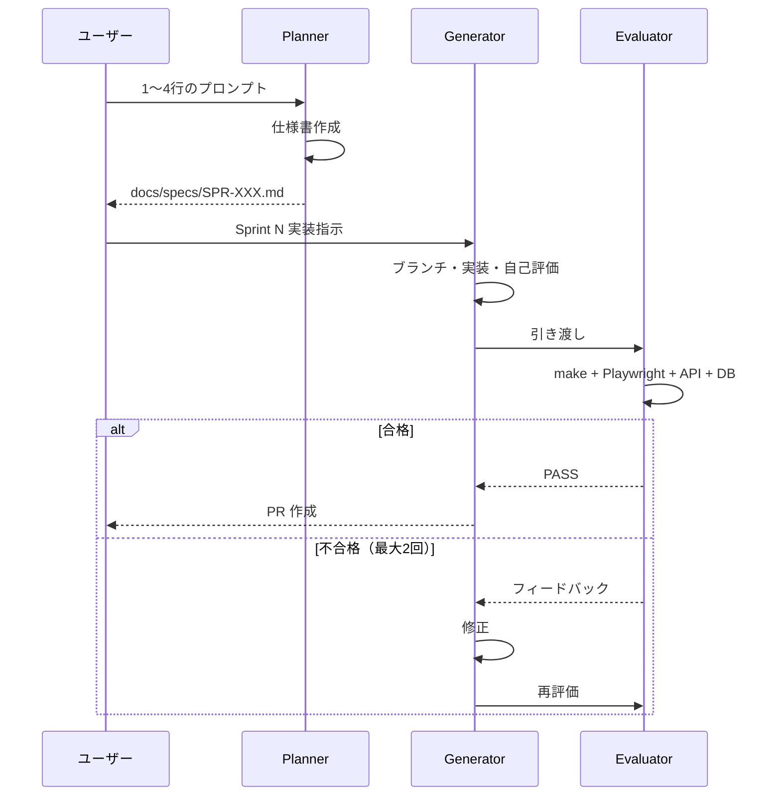

# ハーネスエンジニアリング — 3 サブエージェント

CivilCraft の自動開発ハーネス。**Planner → Generator → Evaluator** の順でスプリントを回す。

## サブエージェント一覧

| エージェント | Skill パス | 役割 |
|-------------|-----------|------|
| **Planner** | `.cursor/skills/planner/` | 1〜4行 → 製品仕様書（WHAT のみ） |
| **Generator** | `.cursor/skills/generator/` | スプリントを1つずつ実装 |
| **Evaluator** | `.cursor/skills/evaluator/` | Playwright MCP 等で検証・合格判定 |

## 起動方法

Cursor で Skill を明示的に指定する。

```
Planner skill で「ソロ用セッションフローを作って」と仕様書を生成
Generator skill で SPR-001 の Sprint 1 を実装
Evaluator skill で Sprint 1 を評価
```

Task サブエージェントを使う場合は、各 Skill の `SKILL.md` をプロンプトに含めて起動する。

## ワークフロー



## ディレクトリ

```
docs/specs/
├── SPR-001-xxx.md          # Planner 出力（仕様書）
└── reports/
    └── SPR-001-sprint-1.md # Evaluator 出力（評価レポート）

.cursor/skills/
├── planner/
├── generator/
└── evaluator/
```

## 役割分担の原則

| 層 | 決めること |
|----|-----------|
| Planner | 何を作るか・受け入れ基準・スプリント分割 |
| Generator | どう作るか・コード・テスト・PR |
| Evaluator | 動くか・基準を満たすか |

Planner が DB スキーマや API パスを書くと、間違いが下流に伝播する。**実装詳細は Generator に任せる。**

## 人間ゲート

以下は自動化しない。

- 仕様書の `## 人間承認が必要` セクション
- ゲームバランスの数値決定
- PR マージ最終承認
- Evaluator 2 回不合格後のエスカレーション

## 関連

- [開発ガイド](./guide.md)
- [AI 利用ルール](../development/ai-usage.md)
