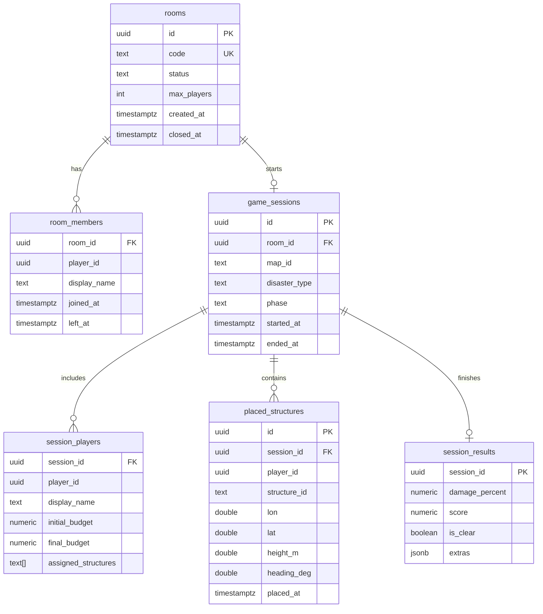

# DB スキーマ設計（ルーム・セッション）

PostgreSQL に永続化するエンティティと、Redis の役割分担を定義する。

関連 Issue: [#79](https://github.com/NUMaters/civileng-project/issues/79)  
関連: [#21](https://github.com/NUMaters/civileng-project/issues/21) ローカル DB、[#20](https://github.com/NUMaters/civileng-project/issues/20) ゲーム状態モデル、[#4](https://github.com/NUMaters/civileng-project/issues/4) セッションフロー

---

## PostgreSQL と Redis の役割

| ストア | 役割 | 例 |
|--------|------|----|
| **PostgreSQL** | 永続・監査・再開の根拠 | ルーム、参加履歴、確定した配置、セッション結果 |
| **Redis** | 短命のリアルタイム状態 | 接続中プレイヤー、ロビー待機、一時ロック、レート制限 |

ゲーム進行中の水位・浸水などの **権威状態** はサーバーメモリ（`internal/game/state`）が一次ソースで、必要に応じて Redis にスナップショット、終了時に PostgreSQL へ結果を書く（[game-state-model.md](./game-state-model.md)）。

---

## ER 概要

---

## テーブル定義（MVP）

### `rooms`

| 列 | 型 | 説明 |
|----|-----|------|
| `id` | UUID PK | ルーム ID |
| `code` | TEXT UNIQUE | 参加用短いコード（任意） |
| `status` | TEXT | `open` / `in_game` / `closed` |
| `max_players` | INT | 既定 4 |
| `created_at` | TIMESTAMPTZ | 作成時刻 |
| `closed_at` | TIMESTAMPTZ NULL | 閉鎖時刻 |

### `room_members`

| 列 | 型 | 説明 |
|----|-----|------|
| `room_id` | UUID FK → rooms | |
| `player_id` | UUID | クライアント生成またはサーバー発行 |
| `display_name` | TEXT | 表示名 |
| `joined_at` | TIMESTAMPTZ | |
| `left_at` | TIMESTAMPTZ NULL | 退出時 |

PK: `(room_id, player_id)`。

### `game_sessions`

| 列 | 型 | 説明 |
|----|-----|------|
| `id` | UUID PK | セッション ID |
| `room_id` | UUID FK → rooms | ソロでもルームを 1 つ作る |
| `map_id` | TEXT | 例: `koriyama-abukuma` |
| `disaster_type` | TEXT | MVP: `heavy-rain` |
| `phase` | TEXT | 最終フェーズまたは `running` 中のメモ |
| `started_at` | TIMESTAMPTZ | |
| `ended_at` | TIMESTAMPTZ NULL | |

### `session_players`

| 列 | 型 | 説明 |
|----|-----|------|
| `session_id` | UUID FK | |
| `player_id` | UUID | |
| `display_name` | TEXT | |
| `initial_budget` | NUMERIC | |
| `final_budget` | NUMERIC NULL | 終了時 |
| `assigned_structures` | TEXT[] | マルチ時の担当施設 |

### `placed_structures`

確定配置のみ永続化する（仮配置はクライアント／メモリ）。

| 列 | 型 | 説明 |
|----|-----|------|
| `id` | UUID PK | |
| `session_id` | UUID FK | |
| `player_id` | UUID | 配置者 |
| `structure_id` | TEXT | game-data の ID |
| `lon` / `lat` / `height_m` | DOUBLE | WGS84 + 楕円体高 |
| `heading_deg` | DOUBLE | 真北から時計回り |
| `placed_at` | TIMESTAMPTZ | |

### `session_results`

| 列 | 型 | 説明 |
|----|-----|------|
| `session_id` | UUID PK FK | |
| `damage_percent` | NUMERIC | 被災度 |
| `score` | NUMERIC | |
| `is_clear` | BOOLEAN | クリア閾値未満か |
| `extras` | JSONB | HUD 用の内訳など |

---

## Redis キー方針（案）

| キーパターン | 用途 | TTL |
|--------------|------|-----|
| `room:{id}:presence` | 接続中 playerId 集合 | 接続ハートビートで更新 |
| `session:{id}:snapshot` | 再接続用の薄いスナップショット | セッション長＋余裕 |
| `lock:place:{session}:{cell}` | 配置競合の短ロック（将来） | 数秒 |

MVP では presence のみでもよい。スナップショットは #58 / #59 で本格化。

---

## マイグレーション方針

- 配置場所: `apps/server/migrations/`
- 実行: `make migrate`（[local-database.md](../development/local-database.md)）
- 命名: `YYYYMMDDHHMMSS_description.up.sql` / `.down.sql`（または採用するツールの規約に合わせる）
- 初回マイグレーション（#88）で上記テーブルを作成する

---

## 関連ドキュメント

| ドキュメント | 内容 |
|--------------|------|
| [game-state-model.md](./game-state-model.md) | メモリ上の GameState |
| [local-database.md](../development/local-database.md) | Compose・接続確認 |
| [communication.md](./communication.md) | サーバー権威・WS |
