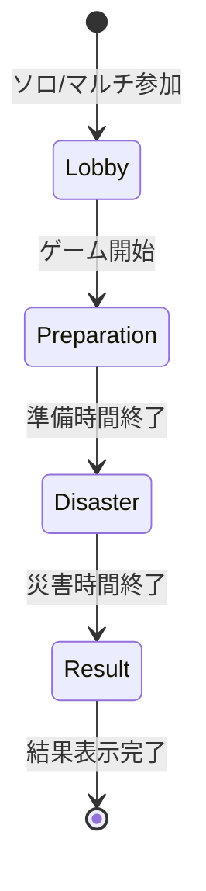

# ゲーム状態モデル（サーバー）

サーバーが保持するゲーム状態（session / tick / snapshot）のモデルを定義する。

関連 Issue: [#20](https://github.com/NUMaters/civileng-project/issues/20)

---

## 概要

CivilCraft は **サーバー権威型** でゲーム判定を行う（[通信方針](./communication.md) 参照）。本編（準備・災害・結果）の状態は `apps/server/internal/game/` 配下で管理する。

ロビー向けのルーム管理は `internal/room/` が担当し、本編開始後は `internal/game/session/` がセッションを引き継ぐ。

---

## モジュール責務

| モジュール | パス                      | 責務                                             |
| ---------- | ------------------------- | ------------------------------------------------ |
| `session`  | `internal/game/session/`  | 1 ゲームセッションのライフサイクル（開始・終了） |
| `state`    | `internal/game/state/`    | フェーズ・プレイヤー・ワールドの現在状態         |
| `tick`     | `internal/game/tick/`     | 固定間隔のゲームループ（水位更新・維持費減算）   |
| `snapshot` | `internal/game/snapshot/` | 状態の永続化・復元（将来の再接続用）             |
| `realtime` | `internal/game/realtime/` | WebSocket 接続・イベント配信                     |

関連モジュール（`internal/` トップレベル）:

| モジュール     | 責務                           |
| -------------- | ------------------------------ |
| `room`         | ロビーのルーム作成・参加・一覧 |
| `player`       | プレイヤー識別・名前           |
| `construction` | 施設配置の判定                 |
| `disaster`     | 災害イベントの進行             |
| `simulation`   | 水位・浸水・被災度の計算       |
| `world`        | 地形・マップデータ             |
| `mapdata`      | マップ JSON の読み込み         |

---

## フェーズ別状態

ゲームフェーズは [game-rules.md](../game-design/game-rules.md) に準拠。

### GameState（`state/game_state.go`）

| フィールド       | 型        | 説明                                  |
| ---------------- | --------- | ------------------------------------- |
| `sessionId`      | string    | セッション識別子                      |
| `phase`          | Phase     | `preparation` / `disaster` / `result` |
| `phaseStartedAt` | timestamp | 現在フェーズ開始時刻                  |
| `phaseEndsAt`    | timestamp | 現在フェーズ終了予定時刻              |
| `waterLevel`     | number    | 河川水位（正規化 0.0〜1.0）           |
| `damagePercent`  | number    | 被災度（%）                           |
| `isFinished`     | boolean   | ゲーム終了フラグ                      |

フェーズ秒数は `packages/game-data/rules/game-timing.json` から読み込む。

### PlayerState（`state/player_state.go`）

| フィールド           | 型                | 説明                   |
| -------------------- | ----------------- | ---------------------- |
| `playerId`           | string            | プレイヤー識別子       |
| `displayName`        | string            | 表示名                 |
| `position`           | Position          | マップ上の座標         |
| `budget`             | number            | 残予算                 |
| `assignedStructures` | StructureType[]   | マルチ時の担当施設種別 |
| `placedStructures`   | PlacedStructure[] | 配置済み施設           |

### WorldState（`state/world_state.go`）

| フィールド     | 型                | 説明                          |
| -------------- | ----------------- | ----------------------------- |
| `mapId`        | string            | 使用中マップ                  |
| `structures`   | PlacedStructure[] | 全施設（建設中・完成含む）    |
| `floodedCells` | CellId[]          | 浸水セル                      |
| `disasterType` | string            | 災害種別（MVP: `heavy-rain`） |

---

## Tick ループ

`internal/game/tick/` が固定間隔（例: 100ms）で以下を実行する。

1. 建設中施設の完成判定
2. 維持費の減算
3. 災害フェーズ中: 水位上昇・浸水計算（`simulation` 委譲）
4. 被災度の更新
5. フェーズ遷移判定
6. 変更を WebSocket でブロードキャスト

---

## Snapshot

`internal/game/snapshot/` は以下の用途で使用する。

| 用途                   | MVP | Phase 3 以降 |
| ---------------------- | :-: | ------------ |
| ゲーム終了時の結果保存 |  ○  | ○            |
| 切断後の再接続復元     |  —  | ○            |

MVP では結果画面表示に必要な最小スナップショットのみ保存する。

---

## 状態遷移の責務境界

| 操作                        | 担当                                     |
| --------------------------- | ---------------------------------------- |
| ルーム作成・参加            | `room`                                   |
| ゲーム開始（ロビー → 準備） | `session`（`room` から引き継ぎ）         |
| 施設配置リクエスト          | `construction` → `state` 更新            |
| 水位・浸水計算              | `simulation`                             |
| 勝敗判定                    | `session`（`simulation` の被災度を参照） |
| クライアント通知            | `realtime`                               |

---

## 関連ドキュメント

- [アーキテクチャ概要](./overview.md)
- [セッションフロー](../game-design/session-flow.md)
- [マスターデータ設計](./game-data-master-data.md)
